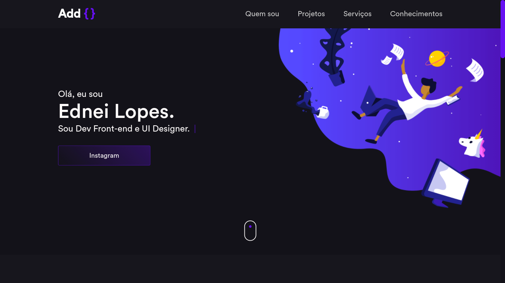

<h1 align="center">
  📰 Portfólio
</h1>

<h4 align="center"><a href="https://edy-ux.github.io/Portfolio/">Clique para visitar o projeto</a></h4>

## 📚 Seções
O site é composto por 5 seções diferentes:

- **Home:** Nele temos um avatar do meu github e um breve apresentação;
- **Quem sou:** Nessa seção tenho uma descrição dizendo um pouco sobre quem sou;
- **Projetos:** Apresenta alguns projetos desenvolvidos e com link direto para os respectivos códigos no GitHub;
- **Serviços:** Exibe através de cards os diferentes serviços em que possuo conhecimentos;
- **Conhecimentos:** Nele apresentamos meus conhecimentos em algumas linguagens como o foco no front-end;

---

## 💼 Tecnologias utilizadas
Para o desenvolvimento deste site utilizei as seguintes tecnologias:

- HTML;
- Sass;
- JavaScript;
- ScrollReveal;

---

## Autor 
<table>
  <tr>
    <td align="center">
      <a href="/">
         
        
          <b>Ednei Lopes</b>
        
      </a>
    </td>
  </tr>
</table>
